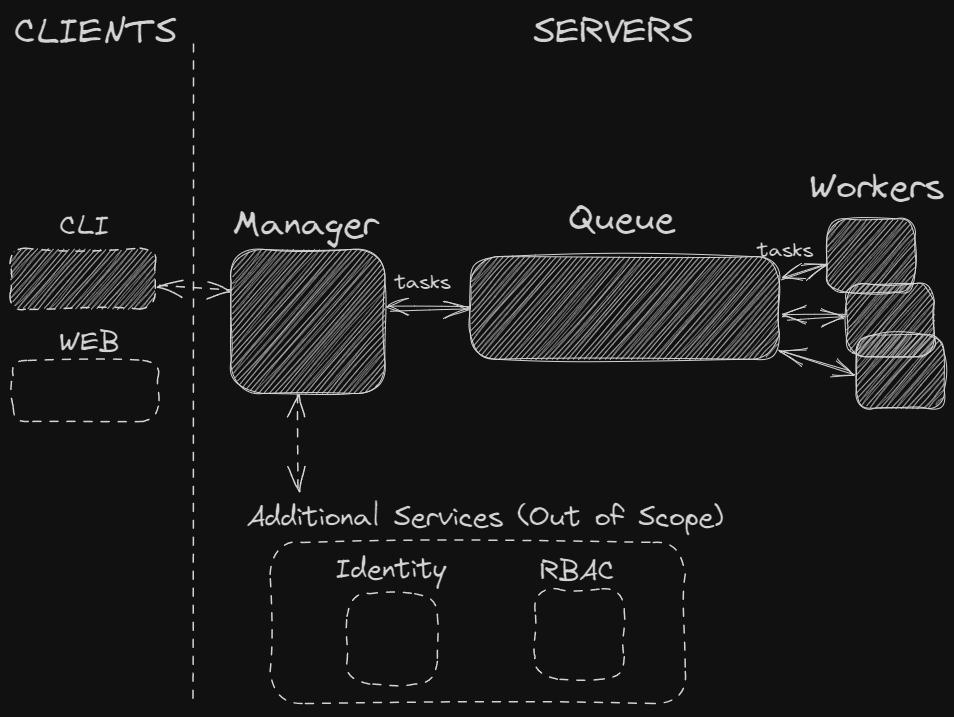

# gotama - **go** **ta**sk **ma**nager
Simple scalable system that can schedule and execute tasks.


* Submit a new task for immediate or periodic execution.
* List all the submitted tasks and their current status.
* View a single task’s details and status.
* Tasks can be run once or recurring.

## Architecture


## Why?
* manager - RESTful API and a dedicated manager and scheduler with flexibility to add authentication, authorization with RBAC/ABAC, a service mesh with mTLS, etc.
* broker - in order to be highly scalable and durable, a message broker implementation with redis and persistent storage is a solid choice.
* workers - horizontally scaling by spawning multiple workers, so each of them can process tasks simultaneously from the message queue with pending tasks. 

## Run locally
Prerequisites
* docker and docker-compose

Configure your environment variable within .evn/.local.env

Start the manager service, the broker (redis) and the workers within docker
```bash
docker-compose up --scale worker=3 -d
```
or run natively
```bash
export $(grep -v '^#' local.env | xargs)
redis-server --requirepass "$${REDIS_PASSWORD:?REDIS_PASSWORD variable is not set}" \
        --port "$${REDIS_PORT:?REDIS_PORT variable is not set}" \
        ./redis/redis.conf&
go run cmd/gotama-manager/main.go&
go run cmd/gotama-worker/main.go&
go run cmd/gotama-worker/main.go&
go run cmd/gotama-worker/main.go&
```
## RESTful API
Add a recurring task:
```bash
curl --location 'http://localhost:8080/api/v1/tasks' \
--header 'Content-Type: application/json' \
--data-raw '{
    "name": "email",
    "type": "recurring",
    "period": "45m",
    "payload": {
        "to": "gotama@gotama.io",
        "title": "Recurring Reminder",
        "body": "Take a break!"
    }
}'
```
Add a task once:
```bash
curl --location 'http://localhost:8080/api/v1/tasks' \
--header 'Content-Type: application/json' \
--data-raw '{
    "name": "email",
    "type": "once",
    "payload": {
        "to": "gotama@gotama.io",
        "title": "Single Reminder",
        "body": "Take a break!"
    }
}'
```
Get a task:
```bash
curl --location 'http://localhost:8080/api/v1/tasks/11ef259c-8523-42e4-8568-9d167dbba9da'
```
Get a list of tasks with pagination:
```bash
curl --location 'http://localhost:8080/api/v1/tasks?limit=100&offset=0'
```
Update a task:
```bash
curl --location --request PUT 'http://localhost:8080/api/v1/tasks/11ef259c-8523-42e4-8568-9d167dbba9da' \
--header 'Content-Type: application/json' \
--data-raw '{
    "name": "email",
    "type": "recurring",
    "period": "5s",
    "payload": {
        "to": "gotama@gotama.io",
        "title": "Reminder",
        "body": "Take a break!"
    }
}'
```
Delete a task:
```bash
curl --location --request DELETE 'http://localhost:8080/api/v1/tasks/11ef259c-8523-42e4-8568-9d167dbba9da'
```
Send SMS:
```bash
curl --location 'http://localhost:8080/api/v1/tasks' \
--header 'Content-Type: application/json' \
--data '{
    "name": "sms",
    "type": "once",
    "payload": {
        "phone": "+{YOUR_PHONE_NUMBER}",
        "text": "Gotama is sending you a message"
    }
}
'
```